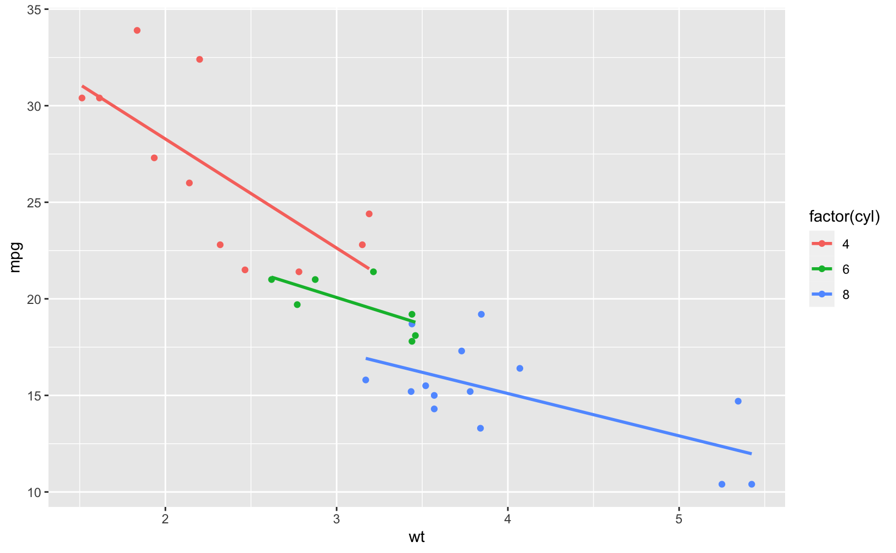

<pre class='chroma'>knitr::<a href='https://rdrr.io/pkg/knitr/man/opts_chunk.html'>opts_chunk</a>$set(
  fig.path = "plots/", # for leaf bundles to work nicely
  cache = TRUE,
  cache.path = "post_cache/", # (for leaf bundles, cache in post directory)
  fig.retina = 2,
  fig.width = 8.5,
  echo = TRUE,
  message = FALSE, warning = FALSE, error = FALSE,
  fig.align = "center",
  out.width = "95%"
)
</pre>

This is a test of {{&lt; pkg "hugodown" &gt;}}.

R Code
------

### Code with/-out Output

<pre class='chroma'>my_packages &lt;- rownames(installed.packages())
n_packages &lt;- length(my_packages)
</pre>

And some filler text between chunks.

<pre class='chroma'>n_packages
#&gt; [1] 407

tail(tibble::<a href='https://tibble.tidyverse.org/reference/enframe.html'>enframe</a>(my_packages))
#&gt; # A tibble: 6 x 2
#&gt;    name value    
#&gt;   &lt;int&gt; &lt;chr&gt;    
#&gt; 1   402 xts      
#&gt; 2   403 yaml     
#&gt; 3   404 yardstick
#&gt; 4   405 zeallot  
#&gt; 5   406 zip      
#&gt; 6   407 zoo
</pre>

### Plots

-   The entire chunk is contained in `<pre>` tags :(
-   Tabular display of code with line numbers is set in config, but not applied here

<pre class='chroma'>library(<a href='https://ggplot2.tidyverse.org/reference'>ggplot2</a>)

<a href='https://ggplot2.tidyverse.org/reference/ggplot.html'>ggplot</a>(mtcars, <a href='https://ggplot2.tidyverse.org/reference/aes.html'>aes</a>(x = wt, y = mpg, color = factor(cyl))) +
  <a href='https://ggplot2.tidyverse.org/reference/geom_point.html'>geom_point</a>() +
  <a href='https://ggplot2.tidyverse.org/reference/geom_smooth.html'>geom_smooth</a>(method = lm, se = FALSE)
</pre>

Footnotes
---------

This is a footnote in `^[inline format]` as used by [pandoc](https://pandoc.org/MANUAL.html#footnotes) but not supported by [Hugo's Goldmark](https://gohugo.io/getting-started/configuration-markup/#goldmark) [^1].

Here's a reference-style footnote [^2].

Math and stuff
--------------

This is text with inline math $\sum_{n=1}^{\infty} 2^{-n} = 1$ and with math blocks:

$$
\sum_{n=1}^{\infty} 2^{-n} = 1
$$

| Heading | Another heading |
|:-------:|:---------------:|
|   text  |       text      |
|   text  |       text      |
|   text  |       text      |

[^1]: Hello there

[^2]: Something goldmark and pandoc can agree on.

